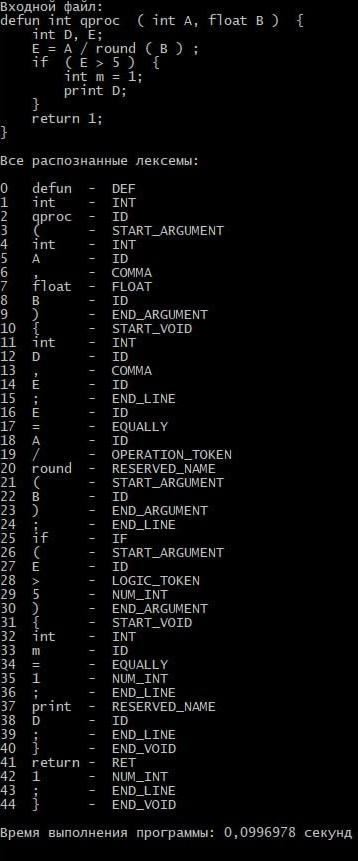
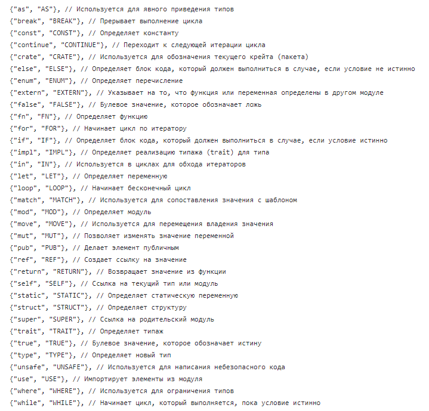
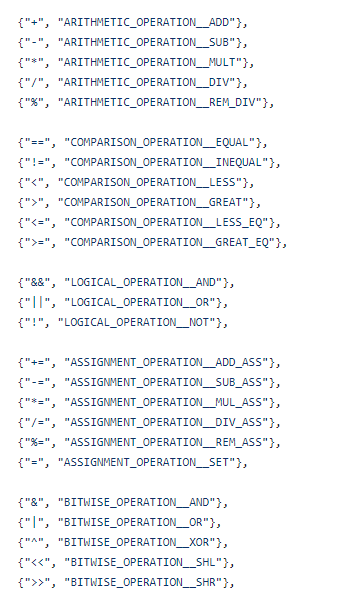

Данная программа - Лексер - принимает на вход программу на языке Rust, затем проходит по ней и обрабатывает все ключевые слова, операторы, названия переменных и числа - и выводит их в порядке следования в программе

Лексер - это первая часть программы Парсера кода с одного языка программирования, на другой  
Вот пример её выполнения:

Она распознаёт такие ключевые слова:

И разные другие операции:

Полную программу парсера с языка Rust на C++ вы можете посмотреть в этом репозитории: https://github.com/GogikOrtey/Translator-from-Rust-to-C-plus-plus
